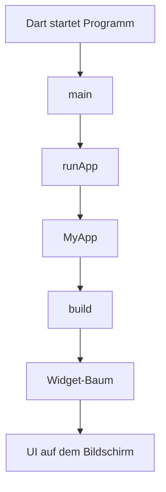
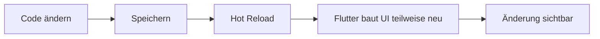

# Visual Summary - 00 Start hier

> Ziel: Du verstehst, wie Flutter überhaupt losläuft.

---

## 1. Startfluss einer Flutter-App



---

## 2. Als Treppe gedacht

```text
1. Betriebssystem startet App
        |
        v
2. Dart ruft main() auf
        |
        v
3. runApp(MyApp()) startet Flutter UI
        |
        v
4. Flutter fragt: Was soll ich bauen?
        |
        v
5. build() gibt Widgets zurück
```

---

## 3. Wo landet dein Code?

```text
sandbox_app/
└── lib/
    └── main.dart   <- hier kopierst du Snippets rein
```

---

## 4. Hot Reload mental



---

## 5. Was du behalten musst

| Sache | Merksatz |
|---|---|
| `main()` | hier beginnt das Programm |
| `runApp()` | hier beginnt die Flutter-Oberfläche |
| `build()` | beschreibt, wie die UI aussieht |
| Hot Reload | schnell testen, ohne komplett neu zu starten |
