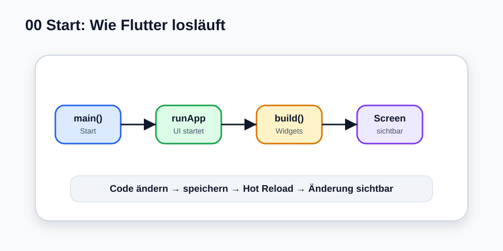

# Visual Summary - 00 Start hier

> Ab hier nutzen wir echte SVG-Grafiken für visuelle Konzepte. Die Grafik soll zuerst das Bild im Kopf bauen, danach kommt Code.

## So liest du die Grafik

- `main()` ist der Startpunkt.
- `runApp(...)` startet die Flutter-Oberfläche.
- `build()` liefert den Widget-Baum.
- Hot Reload zeigt Änderungen schnell an.
