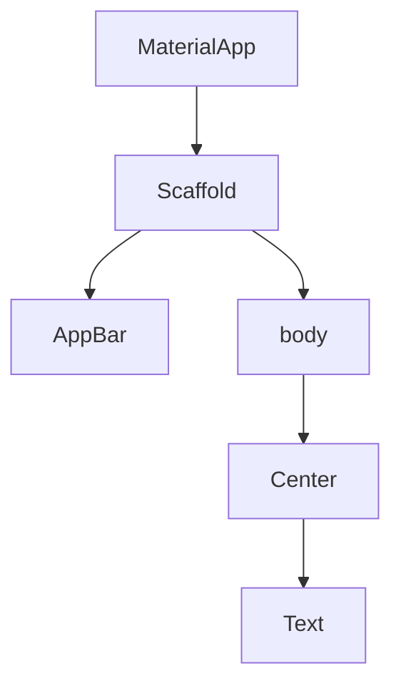

# Visual Summary - 01 Widgets und MaterialApp

## Widget-Baum

Flutter-Oberflächen sind verschachtelte Widgets.



## Als Box gedacht

```text
+------------------------------------------------+
| MaterialApp                                    |
|  +------------------------------------------+  |
|  | Scaffold                                 |  |
|  |  +------------------------------------+  |  |
|  |  | AppBar: Titel                      |  |  |
|  |  +------------------------------------+  |  |
|  |  | body                               |  |  |
|  |  |        +----------------+          |  |  |
|  |  |        | Text           |          |  |  |
|  |  |        +----------------+          |  |  |
|  |  +------------------------------------+  |  |
|  +------------------------------------------+  |
+------------------------------------------------+
```

## Wichtig

Ein Widget kann ein `child` haben oder mehrere `children`.
