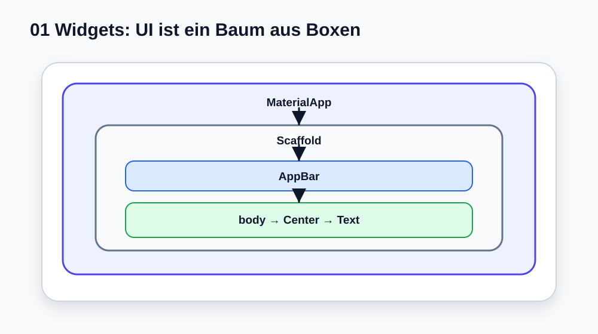

# Visual Summary - 01 Widgets und MaterialApp

> Ab hier nutzen wir echte SVG-Grafiken für visuelle Konzepte. Die Grafik soll zuerst das Bild im Kopf bauen, danach kommt Code.

## So liest du die Grafik

- Widgets sind ineinander verschachtelte Boxen.
- `MaterialApp` liegt außen.
- `Scaffold` baut die Seite.
- `body` enthält den eigentlichen Inhalt.
