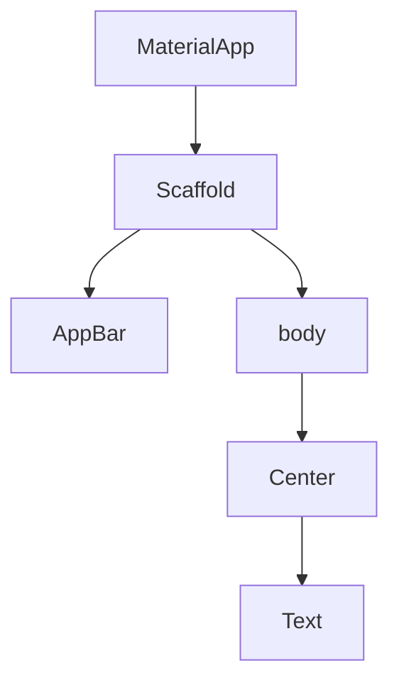

# Visual Summary - 01 Widgets und MaterialApp

> Ziel: Du erkennst Flutter UI als Baum aus Widgets.

---

## 1. Widget-Baum



---

## 2. Dieselbe Struktur als Box

```text
+------------------------------------------------+
| MaterialApp                                    |
|  +------------------------------------------+  |
|  | Scaffold                                 |  |
|  |  +------------------------------------+  |  |
|  |  | AppBar                             |  |  |
|  |  +------------------------------------+  |  |
|  |  | body                               |  |  |
|  |  |        +----------------+          |  |  |
|  |  |        | Center         |          |  |  |
|  |  |        |  +----------+  |          |  |  |
|  |  |        |  | Text     |  |          |  |  |
|  |  |        |  +----------+  |          |  |  |
|  |  |        +----------------+          |  |  |
|  |  +------------------------------------+  |  |
|  +------------------------------------------+  |
+------------------------------------------------+
```

---

## 3. Widget liest man von außen nach innen

```dart
Center(
  child: Text('Hi'),
)
```

```text
Center sagt: Mein Kind soll zentriert werden.
Text sagt: Ich zeige Hi an.
```

---

## 4. child vs children

```text
child:
+---------+
| Parent  |
|   |     |
|   v     |
| Child   |
+---------+
```

```text
children:
+---------+
| Parent  |
| ├ Kind  |
| ├ Kind  |
| └ Kind  |
+---------+
```

---

## 5. Was du behalten musst

| Konzept | Essenz |
|---|---|
| Widget | Baustein der UI |
| Widget-Baum | Widgets sind verschachtelt |
| `child` | ein Kind |
| `children` | mehrere Kinder |
