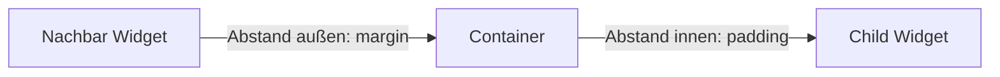
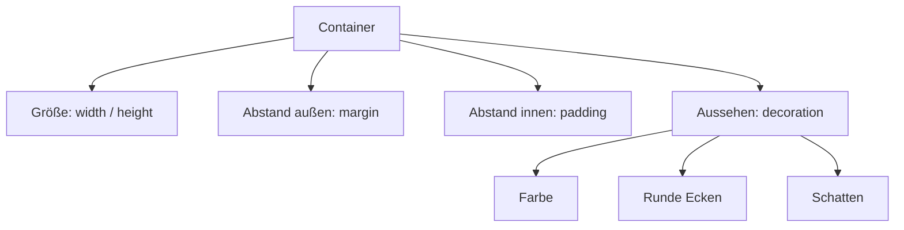

# Visual Summary - 02 Container

> Ziel: Du sollst `Container`, `margin`, `padding` und `decoration` nicht nur lesen, sondern sehen können.

---

## 1. Container als Box

```text
+--------------------------------------+
| Container                            |
|                                      |
|  Hier kann ein child drin liegen     |
|                                      |
+--------------------------------------+
```

Ein `Container` ist eine Box. Diese Box kann selbst gestaltet werden und ein anderes Widget enthalten.

---

## 2. Margin vs Padding

```text
Andere Widgets / Bildschirm

<---------------------- margin ---------------------->

+----------------------------------------------------+
| Container-Rand                                     |
|                                                    |
|   <---------------- padding ------------------->   |
|                                                    |
|          +-------------------------------+         |
|          | child, z. B. Text             |         |
|          +-------------------------------+         |
|                                                    |
+----------------------------------------------------+
```

### Erklärung

| Bereich | Bedeutung |
|---|---|
| `margin` | Abstand außerhalb vom Container |
| Container-Rand | die eigentliche Box |
| `padding` | Abstand innerhalb vom Container |
| `child` | Inhalt des Containers |

---

## 3. Pfeile als Datenbild



---

## 4. So liest du diesen Code visuell

```dart
Container(
  margin: EdgeInsets.all(32),
  padding: EdgeInsets.all(24),
  color: Colors.orange,
  child: Text('Hallo'),
)
```

Wird im Kopf zu:

```text
32 Pixel Abstand zur Außenwelt

+----------------------------------+
| orangener Container              |
|                                  |
| 24 Pixel Abstand nach innen      |
|                                  |
|     Hallo                        |
|                                  |
+----------------------------------+
```

---

## 5. Padding ändert den Inhalt

```text
Ohne Padding:
+------------+
|Text        |
+------------+

Mit Padding:
+------------+
|            |
|   Text     |
|            |
+------------+
```

`padding` bewegt nicht die Box. Es bewegt den Inhalt **in** der Box.

---

## 6. Margin ändert die Position der Box

```text
Ohne Margin:
+----------++----------+
| Box A    || Box B    |
+----------++----------+

Mit Margin:
+----------+      +----------+
| Box A    |      | Box B    |
+----------+      +----------+
```

`margin` bewegt nicht den Text im Container. Es schafft Platz **um** den Container herum.

---

## 7. Decoration erweitert die Box

```text
Container
+----------------------------------+
| BoxDecoration                    |
| - color                          |
| - borderRadius                   |
| - boxShadow                      |
| - border                         |
+----------------------------------+
```



---

## 8. Entscheidungshilfe

| Du willst... | Dann nutze... |
|---|---|
| Text weg vom Rand | `padding` |
| Box weg von anderen Widgets | `margin` |
| Box breiter machen | `width` |
| Box höher machen | `height` |
| runde Ecken | `decoration: BoxDecoration(borderRadius: ...)` |
| Schatten | `boxShadow` |

---

## 9. Wichtigster Merksatz

> `margin` ist Abstand außerhalb der Box. `padding` ist Abstand innerhalb der Box.

Wenn du das verstehst, verstehst du einen riesigen Teil von Flutter-Layout.
