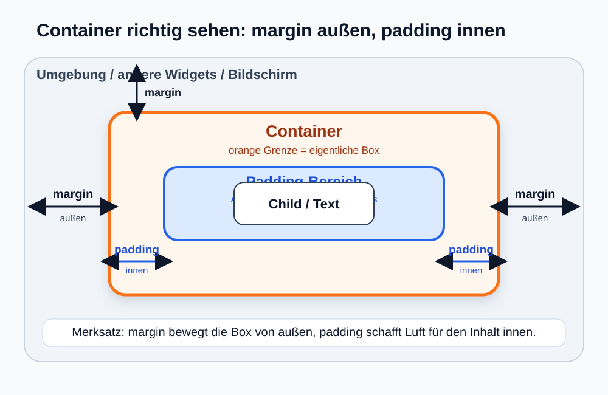
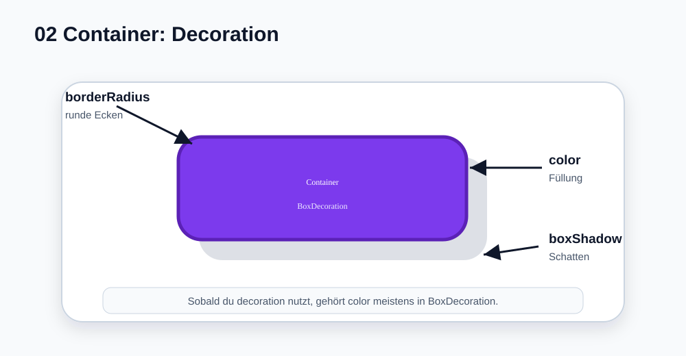

# Visual Summary - 02 Container

> Für Layout-Themen wie `margin` und `padding` nutzen wir ab hier **echte SVG-Diagramme**, damit man Boxen, Abstände und Ebenen wirklich sieht.

---

## 1. Margin vs Padding als echte Box-Grafik



### So liest du die Grafik

- **graue Fläche** = Umgebung / andere Widgets / Bildschirm
- **orange Box** = der eigentliche `Container`
- **orange markierte Strecke außen** = `margin`
- **blaue Fläche innen** = `padding`
- **weiße Box in der Mitte** = `child`, also z. B. `Text`, `Icon` oder ein anderes Widget

### Wichtigster Punkt

- `margin` schafft **Platz außerhalb** des Containers
- `padding` schafft **Platz innerhalb** des Containers

---

## 2. Das gleiche Konzept direkt am Code

```dart
Container(
  margin: const EdgeInsets.all(32),
  padding: const EdgeInsets.all(24),
  color: Colors.orange,
  child: const Text('Hallo'),
)
```

### Was davon wo wirkt

| Code | Sichtbare Wirkung |
|---|---|
| `margin: EdgeInsets.all(32)` | Die ganze Box bekommt außen Luft |
| `padding: EdgeInsets.all(24)` | Der Inhalt rückt von der Box-Grenze weg |
| `color: Colors.orange` | Die Box bekommt eine Hintergrundfarbe |
| `child: Text('Hallo')` | Der Text ist der Inhalt der Box |

---

## 3. Decoration als echte Grafik



### So liest du die Grafik

- **violette Box** = sichtbarer Container
- **runde Ecken** = `borderRadius`
- **grauer Schatten dahinter** = `boxShadow`
- **Farbe der Box** = `color` innerhalb von `BoxDecoration`

---

## 4. Wann nehme ich was?

| Du willst... | Dann brauchst du... |
|---|---|
| Abstand zur Außenwelt | `margin` |
| Abstand vom Inhalt zum Rand | `padding` |
| Farbe, runde Ecken, Schatten | `decoration: BoxDecoration(...)` |
| nur eine einfache Hintergrundfarbe | `color` |

---

## 5. Typischer Anfängerfehler

Falsch oder zumindest problematisch:

```dart
Container(
  color: Colors.blue,
  decoration: BoxDecoration(
    borderRadius: BorderRadius.circular(16),
  ),
)
```

Besser:

```dart
Container(
  decoration: BoxDecoration(
    color: Colors.blue,
    borderRadius: BorderRadius.circular(16),
  ),
)
```

### Warum?

Wenn `decoration` das Aussehen steuert, sollte die Farbe meistens **dort** mit rein, damit alles zusammen definiert ist.

---

## 6. Merksatz

> `margin` bewegt die Box nach außen weg. `padding` bewegt den Inhalt nach innen weg.
