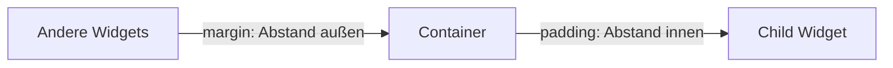

# Visual Summary - 02 Container

Hier siehst du, was `margin` und `padding` bedeuten.

## Margin und Padding als Skizze

```text
Außenwelt / andere Widgets

<------------------- margin ------------------->

+------------------------------------------------+
| Container-Grenze                               |
|                                                |
|   <-------------- padding ---------------->    |
|                                                |
|        +------------------------------+        |
|        | child, z. B. Text            |        |
|        +------------------------------+        |
|                                                |
+------------------------------------------------+
```

## Pfeil-Erklärung



## Was ist was?

| Begriff | Wo ist der Abstand? | Beispiel |
|---|---|---|
| `margin` | außerhalb vom Container | Abstand zu anderen Widgets |
| `padding` | innerhalb vom Container | Abstand zwischen Rand und Inhalt |
| `width` | Breite vom Container | `width: 200` |
| `height` | Höhe vom Container | `height: 100` |
| `decoration` | Aussehen vom Container | runde Ecken, Schatten, Farbe |

## Container mit Decoration

```text
+------------------------------------+
| BoxDecoration                      |
| color: purple                      |
| borderRadius: rund                 |
| boxShadow: Schatten                |
|                                    |
|        Text oder anderes Widget    |
+------------------------------------+
```

## Merksatz

`margin` schiebt den Container von außen weg. `padding` schiebt den Inhalt im Container nach innen.
