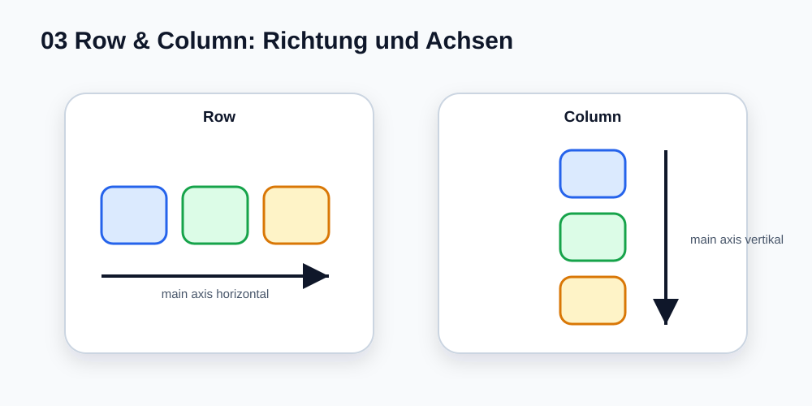
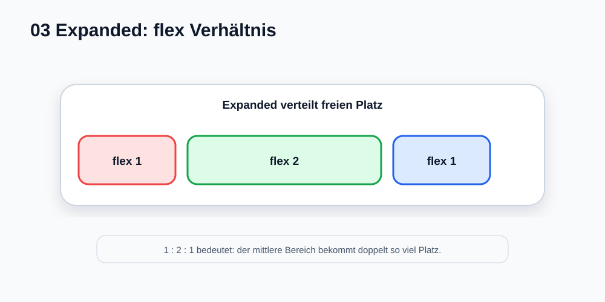

# Visual Summary - 03 Row und Column

> `Row`, `Column` und `Expanded` sind Layout-Werkzeuge. Die Richtung und die Platzverteilung sieht man am besten als Grafik.

## 1. Row und Column

## 2. Expanded und flex

## Merksatz

- `Row` stapelt horizontal.
- `Column` stapelt vertikal.
- `Expanded` verteilt freien Platz.
- `flex` bestimmt das Verhältnis.
