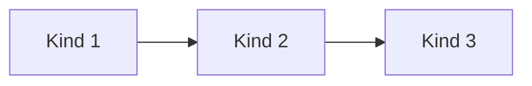
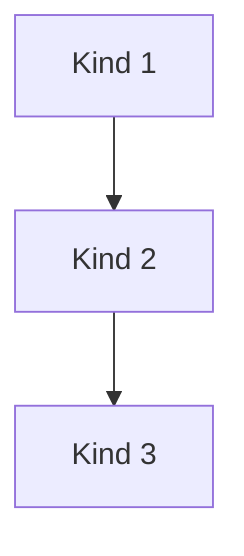

# Visual Summary - 03 Row und Column

---

## Row

```text
Row = horizontal

+----------+----------+----------+
| Kind 1   | Kind 2   | Kind 3   |
+----------+----------+----------+
```



---

## Column

```text
Column = vertikal

+----------+
| Kind 1   |
+----------+
| Kind 2   |
+----------+
| Kind 3   |
+----------+
```



---

## Main Axis und Cross Axis

```text
Row:
mainAxis  ----------->
crossAxis |
          v

Column:
mainAxis  |
          v
crossAxis ----------->
```

---

## Expanded

```text
Row mit flex: 1 / 2 / 1

+----------+--------------------+----------+
|   1x     |        2x          |   1x     |
+----------+--------------------+----------+
```

`Expanded` sagt: Nimm freien Platz. Mit `flex` sagst du, wie viel im Vergleich zu den anderen.
