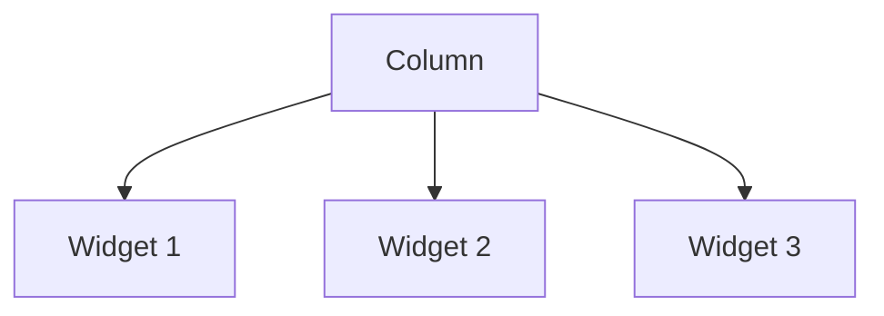
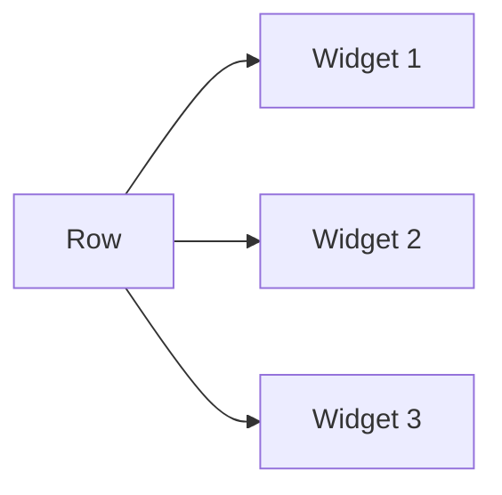

# Visual Summary - 03 Row und Column

## Column: untereinander

```text
Column
  |
  +-- Text 1
  |
  +-- SizedBox height: 12
  |
  +-- Text 2
  |
  +-- SizedBox height: 12
  |
  +-- Text 3
```



## Row: nebeneinander

```text
Row
  +----------+----------+----------+
  | Icon     | Text     | Icon     |
  +----------+----------+----------+
```



## Expanded: freier Platz wird verteilt

```text
Row mit flex: 1 / 2 / 1

+----------+--------------------+----------+
|   1x     |        2x          |   1x     |
+----------+--------------------+----------+
```

## Merksatz

`Column` stapelt vertikal. `Row` stapelt horizontal. `Expanded` teilt freien Platz auf.
