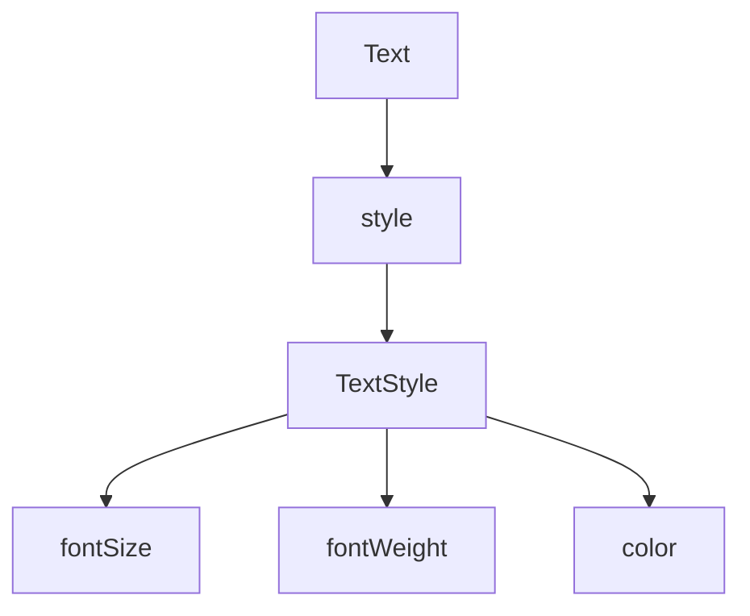

# Visual Summary - 04 Text, Style und Icons

> Ziel: Du verstehst, wie Flutter UI lesbarer und erkennbarer wird.

---

## 1. Text ohne Style vs mit Style

```text
Ohne Style:
+----------------+
| Hallo          |
+----------------+

Mit Style:
+------------------------------+
| HALLO   groß / fett / farbig |
+------------------------------+
```

---

## 2. TextStyle hängt am Text



---

## 3. Icon ist auch ein Widget

```text
Row
+-----------+------------+---------------------+
| Icon      | Abstand    | Text                |
+-----------+------------+---------------------+
```

```dart
Row(
  children: [
    Icon(Icons.favorite),
    SizedBox(width: 12),
    Text('Like'),
  ],
)
```

---

## 4. Wann benutze ich was?

| Ziel | Widget / Property |
|---|---|
| Text anzeigen | `Text` |
| Text größer machen | `fontSize` |
| Text fett machen | `fontWeight` |
| Symbol anzeigen | `Icon` |
| Abstand zwischen Icon und Text | `SizedBox` |

---

## 5. Was du behalten musst

`TextStyle` verändert den Text. `Icon` ist ein normales Widget und kann überall stehen, wo auch andere Widgets stehen.
