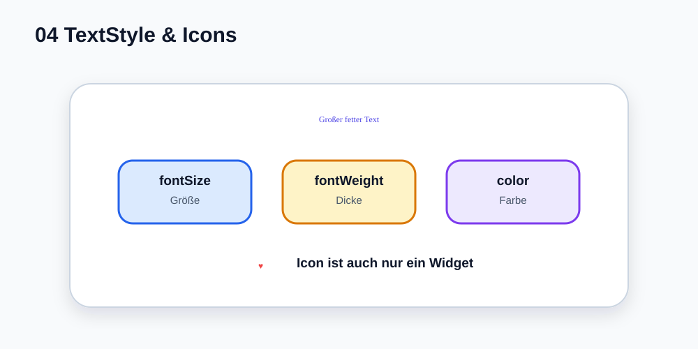

# Visual Summary - 04 Text, Style und Icons

> Ab hier nutzen wir echte SVG-Grafiken für visuelle Konzepte. Die Grafik soll zuerst das Bild im Kopf bauen, danach kommt Code.

## So liest du die Grafik

- `TextStyle` hängt am `Text`.
- `fontSize` verändert Größe.
- `fontWeight` verändert Dicke.
- `Icon` ist ein normales Widget.
