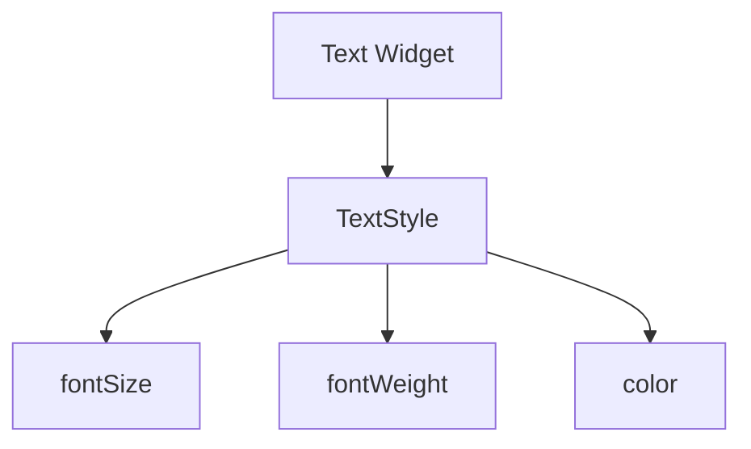

# Visual Summary - 04 Text, Style und Icons

## TextStyle wirkt auf Text



## Vorher / Nachher

```text
Ohne Style:
Hallo

Mit Style:
HALLO   größer, fett, farbig
```

## Icon plus Text

```text
Row
+------------+------------------------+
| Icon ❤️    | Flutter macht Spaß     |
+------------+------------------------+
```

## Merksatz

`TextStyle` verändert, wie Text aussieht. `Icon` ist ein eigenes Widget und kann wie Text in Row/Column benutzt werden.
