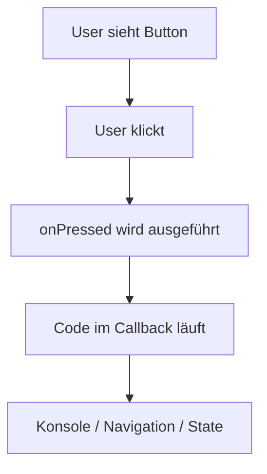

# Visual Summary - 05 Buttons und Klicks

> Ziel: Du verstehst, wie aus UI eine Aktion wird.

---

## 1. Button-Aufbau

```text
+--------------------------------+
| ElevatedButton                 |
|                                |
|  child: sichtbarer Inhalt      |
|  onPressed: Klick-Logik        |
+--------------------------------+
```

---

## 2. Klick-Ablauf



---

## 3. Callback als gespeicherte Aktion

```dart
onPressed: () {
  debugPrint('Klick');
}
```

```text
() { ... }
= Funktion ohne Namen
= wird später ausgeführt
= hier beim Klick
```

---

## 4. Häufiger Unterschied

```dart
onPressed: sayHello      // richtig: Funktion wird übergeben
onPressed: sayHello()    // oft falsch: Funktion wird sofort ausgeführt
```

---

## 5. Was du behalten musst

| Teil | Bedeutung |
|---|---|
| `child` | was man sieht |
| `onPressed` | was beim Klick passiert |
| `null` | Button deaktiviert |
| `() {}` | anonyme Funktion |
