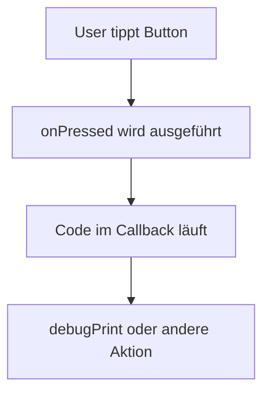

# Visual Summary - 05 Buttons und Klicks

## Klick-Ablauf



## Button als Box

```text
+--------------------------+
| ElevatedButton           |
|                          |
|   child: Text            |
|   onPressed: Funktion    |
+--------------------------+
```

## Callback-Idee

```text
onPressed: () {
  // passiert erst beim Klick
}
```

## Merksatz

`onPressed` speichert Code, der später beim Klick ausgeführt wird.
