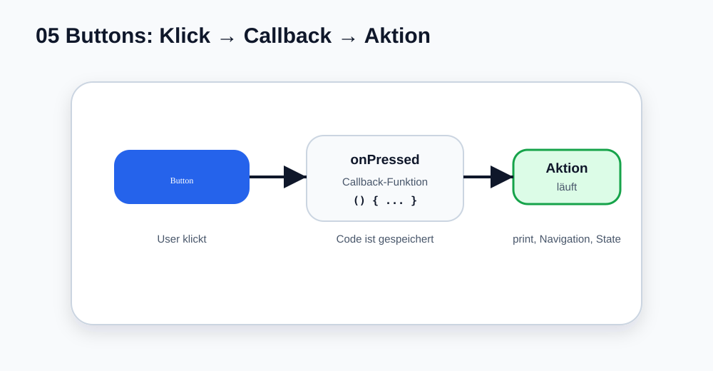

# Visual Summary - 05 Buttons und Klicks

> Ab hier nutzen wir echte SVG-Grafiken für visuelle Konzepte. Die Grafik soll zuerst das Bild im Kopf bauen, danach kommt Code.

## So liest du die Grafik

- Der Button ist sichtbar.
- `onPressed` speichert die Aktion.
- Beim Klick läuft der Callback.
- Später kann der Callback State, Navigation oder Logs auslösen.
