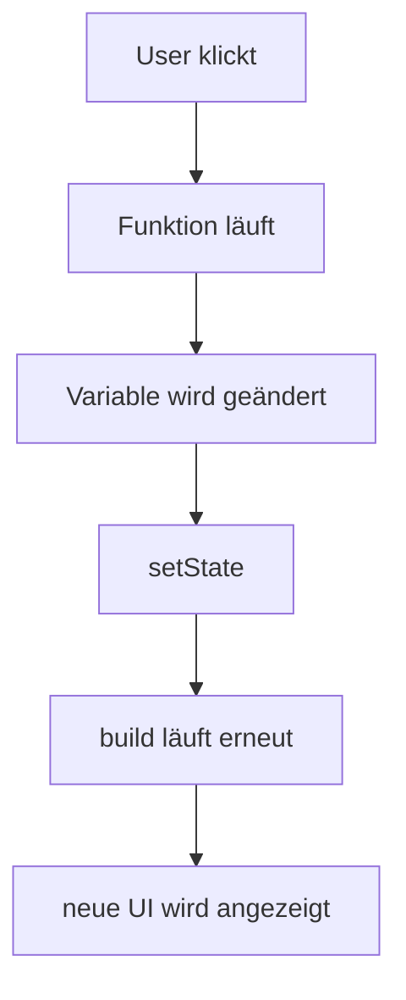

# Visual Summary - 06 StatefulWidget und setState

> Ziel: Du verstehst, wie sich UI verändert.

---

## 1. Stateless vs Stateful

```text
StatelessWidget
+-----------------------------+
| Daten ändern sich nicht     |
| Beispiel: Logo, Überschrift |
+-----------------------------+

StatefulWidget
+-----------------------------+
| Daten können sich ändern    |
| Beispiel: Counter, Toggle   |
+-----------------------------+
```

---

## 2. setState Ablauf



---

## 3. Counter im Kopf

```text
Vor Klick:
counter = 0
UI: Counter: 0

Klick:
setState -> counter++

Nach Klick:
counter = 1
UI: Counter: 1
```

---

## 4. StatefulWidget besteht aus zwei Teilen

```text
+---------------------------+
| StatefulWidget            |
| erstellt State            |
+-------------+-------------+
              |
              v
+---------------------------+
| State                     |
| speichert Werte           |
| enthält build + setState  |
+---------------------------+
```

---

## 5. Ohne setState

```text
Variable wird geändert
        |
        v
Flutter merkt es nicht sicher
        |
        v
UI bleibt gleich
```

---

## 6. Was du behalten musst

> Wenn eine Änderung sichtbar werden soll, muss sie in `setState` passieren oder eine andere State-Lösung nutzen.
