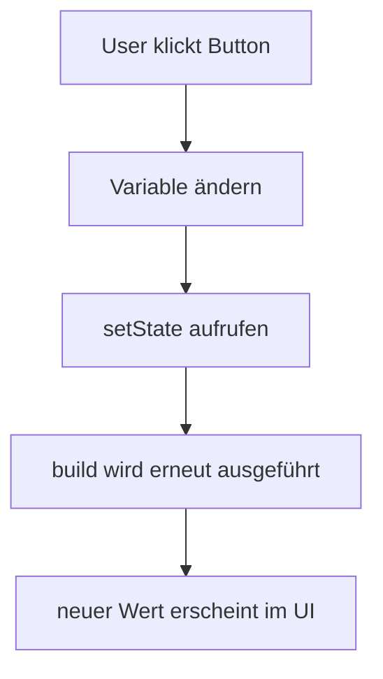

# Visual Summary - 06 StatefulWidget und setState

## Warum State?

Wenn sich Werte ändern, muss Flutter wissen: Bitte UI neu bauen.



## Counter als Ablauf

```text
Start:
counter = 0

Klick auf +1:
counter = counter + 1
setState(...)

UI danach:
Counter: 1
```

## StatefulWidget als Team

```text
+----------------------------+
| StatefulWidget             |
| sagt: Dieses Widget hat    |
| veränderbare Daten         |
+-------------+--------------+
              |
              v
+----------------------------+
| State Klasse               |
| speichert Variablen        |
| enthält setState           |
+----------------------------+
```

## Merksatz

Ohne `setState` ändert sich vielleicht eine Variable, aber Flutter zeichnet den Bildschirm nicht neu.
