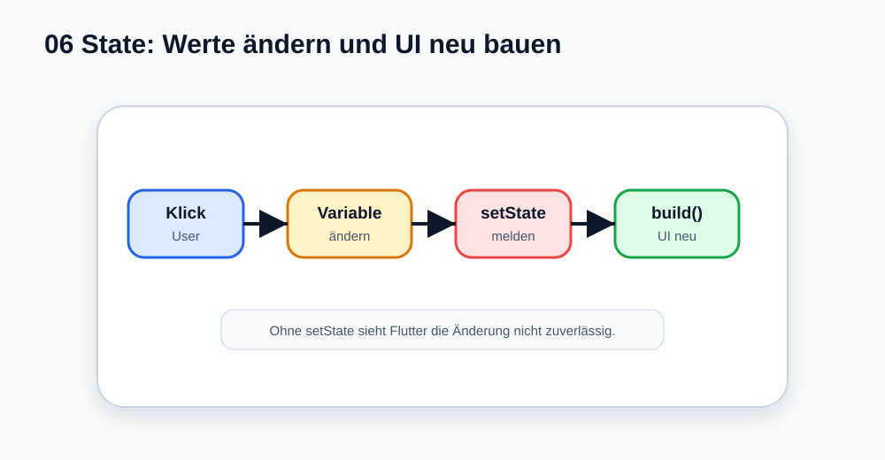

# Visual Summary - 06 StatefulWidget und setState

> Ab hier nutzen wir echte SVG-Grafiken für visuelle Konzepte. Die Grafik soll zuerst das Bild im Kopf bauen, danach kommt Code.

## So liest du die Grafik

- User-Aktion verändert eine Variable.
- `setState` meldet Flutter die Änderung.
- `build()` läuft erneut.
- Die UI zeigt den neuen Wert.
