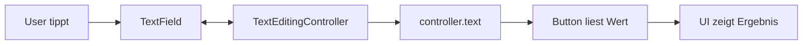
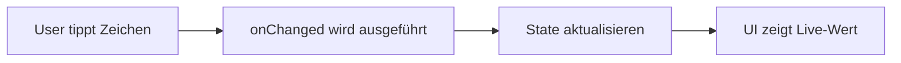

# Visual Summary - 07 Inputs und TextField

> Ziel: Du verstehst, wie Text vom User in deine App kommt.

---

## 1. TextField Grundidee

```text
+------------------------------------+
| TextField                          |
| User tippt hier Text ein           |
+------------------------------------+
```

---

## 2. Mit Controller



---

## 3. Ohne Controller: onChanged



---

## 4. Controller als Fernbedienung

```text
TextEditingController
├── Text lesen: controller.text
├── Text ändern: controller.text = 'Hi'
├── Text leeren: controller.clear()
└── aufräumen: controller.dispose()
```

---

## 5. Warum dispose?

```text
Widget wird entfernt
        |
        v
Controller wird nicht mehr gebraucht
        |
        v
dispose() räumt auf
```

---

## 6. Was du behalten musst

| Situation | Gute Lösung |
|---|---|
| Text später per Button auslesen | Controller |
| bei jedem Zeichen reagieren | `onChanged` |
| TextField nach Speichern leeren | `controller.clear()` |
| Controller benutzt | später `dispose()` |
