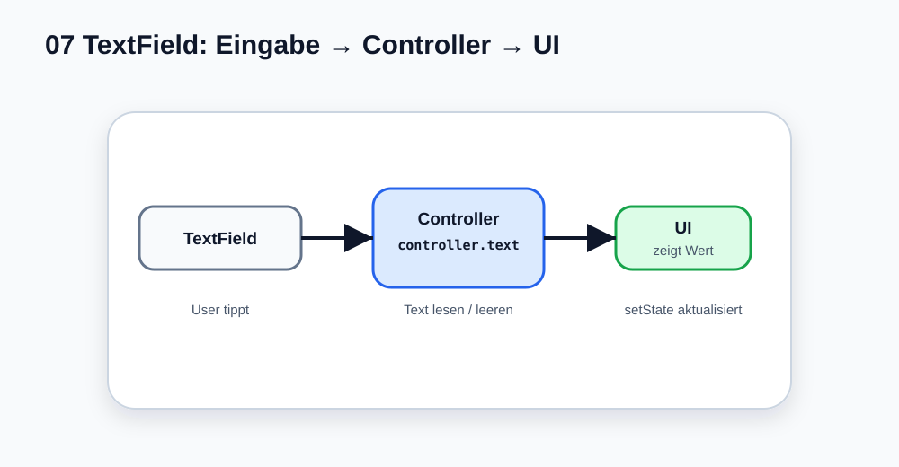

# Visual Summary - 07 Inputs und TextField

> Ab hier nutzen wir echte SVG-Grafiken für visuelle Konzepte. Die Grafik soll zuerst das Bild im Kopf bauen, danach kommt Code.

## So liest du die Grafik

- Der User tippt ins `TextField`.
- Der Controller hält den aktuellen Text.
- Der Button liest `controller.text`.
- `setState` zeigt das Ergebnis.
