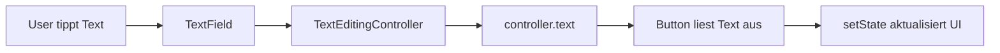

# Visual Summary - 07 Inputs und TextField

## TextField mit Controller



## Skizze

```text
+----------------------------------+
| TextField                        |
| Eingabe: Real                    |
+----------------------------------+
              |
              v
+----------------------------------+
| controller.text == "Real"        |
+----------------------------------+
              |
              v
+----------------------------------+
| Text("Hallo Real!")             |
+----------------------------------+
```

## dispose

```text
Widget weg vom Bildschirm
        |
        v
dispose() wird aufgerufen
        |
        v
controller.dispose()
```

## Merksatz

Der Controller ist wie eine Fernbedienung für das TextField: Du kannst den Text lesen, ändern oder leeren.
