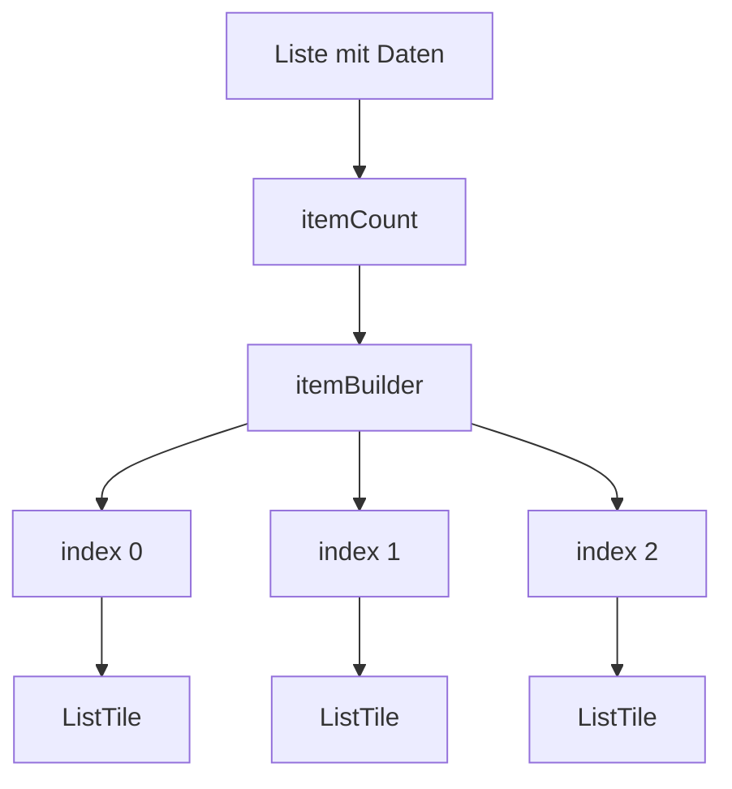

# Visual Summary - 08 ListView

## ListView als Scroll-Liste

```text
Bildschirm
+----------------------------+
| ListTile 1                 |
+----------------------------+
| ListTile 2                 |
+----------------------------+
| ListTile 3                 |
+----------------------------+
| ListTile 4                 |
+----------------------------+
| ... scrollt weiter         |
+----------------------------+
```

## ListView.builder



## Index-Idee

```text
names = ['Ada', 'Linus', 'Grace']

index 0 -> Ada
index 1 -> Linus
index 2 -> Grace
```

## Merksatz

`ListView.builder` baut Listeneinträge erst dann, wenn sie gebraucht werden.
