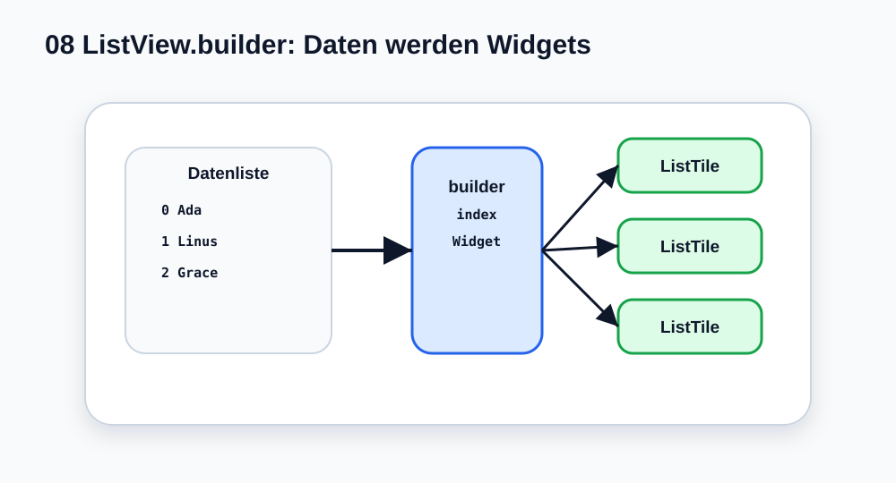

# Visual Summary - 08 ListView

> Ab hier nutzen wir echte SVG-Grafiken für visuelle Konzepte. Die Grafik soll zuerst das Bild im Kopf bauen, danach kommt Code.

## So liest du die Grafik

- Eine Datenliste enthält Werte.
- `itemCount` sagt wie viele.
- `itemBuilder` bekommt den `index`.
- Aus jedem Datensatz entsteht ein Widget.
