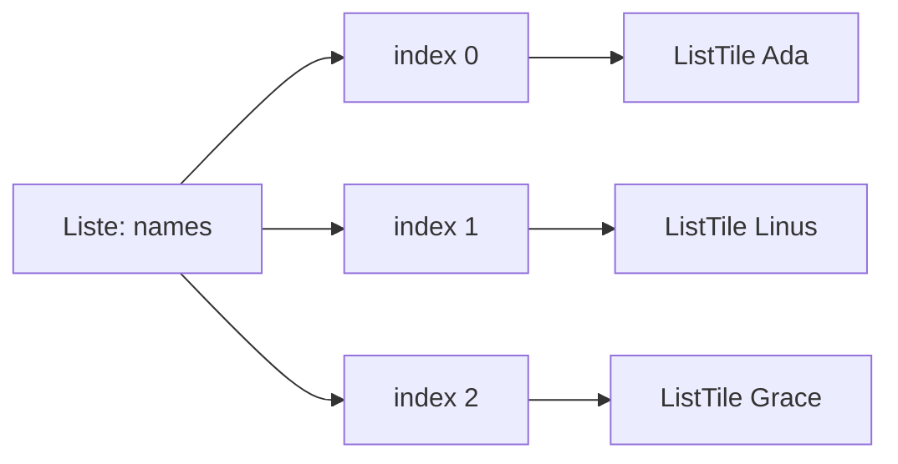

# Visual Summary - 08 ListView

> Ziel: Du verstehst, wie Listen aus Daten entstehen.

---

## 1. ListView als scrollbare Column

```text
Bildschirm
+----------------------------+
| Eintrag 1                  |
+----------------------------+
| Eintrag 2                  |
+----------------------------+
| Eintrag 3                  |
+----------------------------+
| Eintrag 4                  |
+----------------------------+
| ...                        |
+----------------------------+
```

---

## 2. Datenliste wird UI-Liste



---

## 3. builder Prinzip

```text
ListView.builder fragt:

Wie viele? -> itemCount
Wie baue ich jeden Eintrag? -> itemBuilder
Welcher Eintrag? -> index
```

---

## 4. Index visuell

```text
names = ['Ada', 'Linus', 'Grace']

+-------+---------+
| index | value   |
+-------+---------+
| 0     | Ada     |
| 1     | Linus   |
| 2     | Grace   |
+-------+---------+
```

---

## 5. ListView in Column

```text
Column
├── Suchfeld
├── Button
└── Expanded
    └── ListView.builder
```

Ohne `Expanded` weiß die Liste manchmal nicht, wie hoch sie sein darf.

---

## 6. Was du behalten musst

`ListView.builder` ist der Standard, wenn UI aus einer Datenliste gebaut wird.
