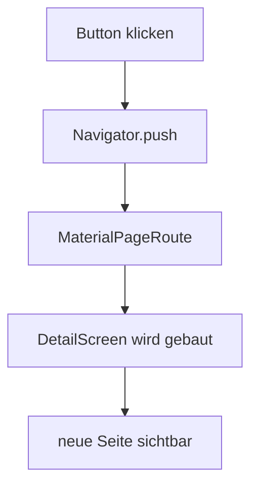
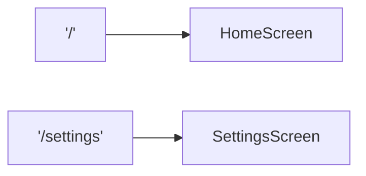

# Visual Summary - 09 Navigation

## Navigator Stack

Navigation funktioniert wie ein Stapel Karten.

```text
Start:
+--------------+
| HomeScreen   |
+--------------+

Nach Navigator.push:
+--------------+
| DetailScreen |
+--------------+
| HomeScreen   |
+--------------+

Nach Zurück:
+--------------+
| HomeScreen   |
+--------------+
```

## Ablauf



## Named Routes



## Merksatz

Eine Seite ist auch nur ein Widget. `Navigator` legt Seiten auf einen Stack.
