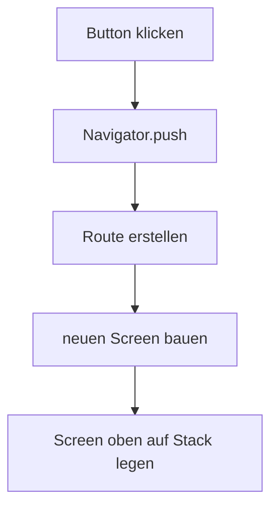
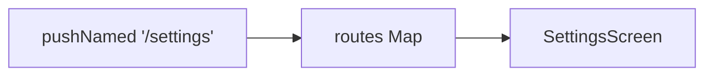

# Visual Summary - 09 Navigation

> Ziel: Du verstehst Seitenwechsel als Stack.

---

## 1. Eine Seite ist ein Widget

```text
HomeScreen = Widget
SettingsScreen = Widget
DetailScreen = Widget
```

---

## 2. Navigator Stack

```text
Start:
+--------------+
| HomeScreen   |
+--------------+

Nach push Detail:
+--------------+
| DetailScreen |
+--------------+
| HomeScreen   |
+--------------+

Nach pop / Zurück:
+--------------+
| HomeScreen   |
+--------------+
```

---

## 3. Push Ablauf



---

## 4. Named Routes

```text
Routen-Tabelle
+-------------+----------------+
| Name        | Screen         |
+-------------+----------------+
| /           | HomeScreen     |
| /settings   | SettingsScreen |
+-------------+----------------+
```



---

## 5. Was du behalten musst

| Aktion | Bedeutung |
|---|---|
| `push` | neue Seite öffnen |
| `pop` | zurückgehen |
| `pushNamed` | über Routennamen öffnen |
| `routes` | Tabelle aus Namen und Screens |
