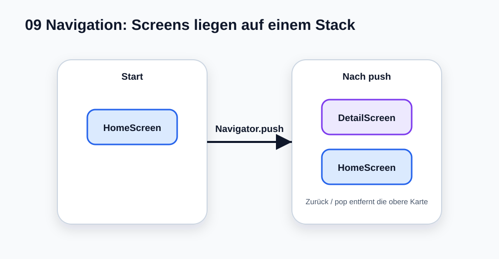

# Visual Summary - 09 Navigation

> Ab hier nutzen wir echte SVG-Grafiken für visuelle Konzepte. Die Grafik soll zuerst das Bild im Kopf bauen, danach kommt Code.

## So liest du die Grafik

- `Navigator` funktioniert wie ein Stapel.
- `push` legt eine neue Seite oben drauf.
- `pop` entfernt die obere Seite.
- Eine Seite ist auch nur ein Widget.
