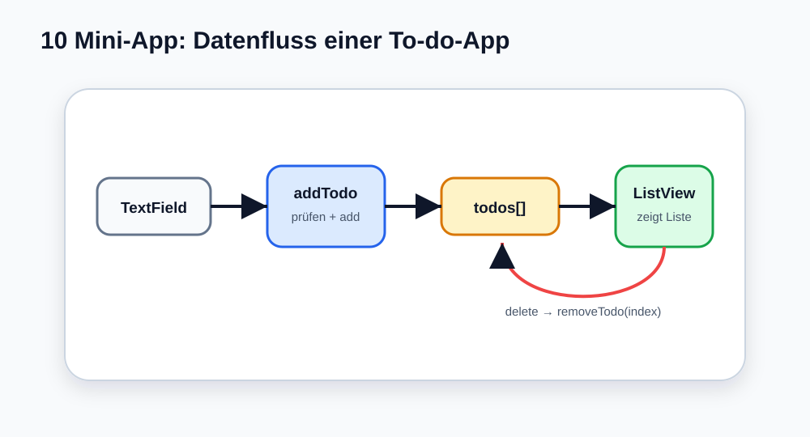

# Visual Summary - 10 Zusammenhängende Mini-App

> Ab hier nutzen wir echte SVG-Grafiken für visuelle Konzepte. Die Grafik soll zuerst das Bild im Kopf bauen, danach kommt Code.

## So liest du die Grafik

- TextField sammelt Eingabe.
- `addTodo()` prüft und speichert.
- `todos[]` ist die Datenquelle.
- `ListView.builder` zeigt die Liste.
- Delete ruft `removeTodo(index)` auf.
