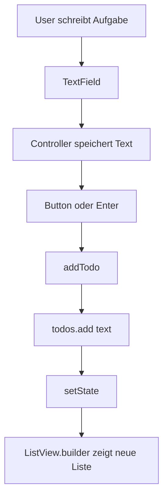
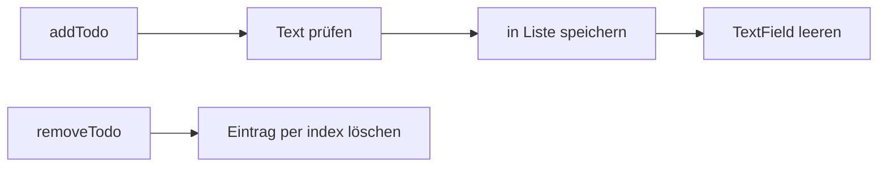

# Visual Summary - 10 Zusammenhängende Mini-App

Hier verbinden sich mehrere Konzepte zu einer kleinen To-do-App.

## Datenfluss



## App-Aufbau

```text
Scaffold
+-----------------------------------+
| AppBar: Mini To-do App            |
+-----------------------------------+
| TextField                         |
| Button: Hinzufügen                |
|                                   |
| Expanded                          |
|  +-----------------------------+  |
|  | ListView.builder            |  |
|  |  - Aufgabe 1    [delete]    |  |
|  |  - Aufgabe 2    [delete]    |  |
|  +-----------------------------+  |
+-----------------------------------+
```

## Funktionen



## Merksatz

Eine App entsteht, wenn Widgets, State, Eingaben und Listen zusammenarbeiten.
