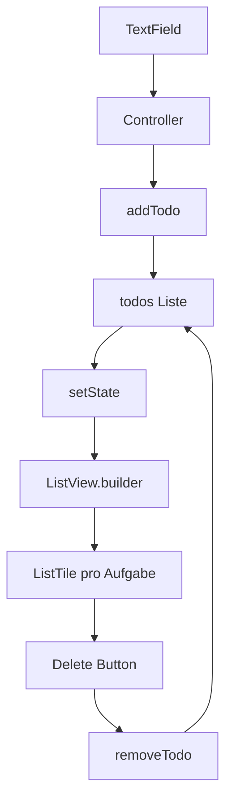

# Visual Summary - 10 Zusammenhängende Mini-App

> Ziel: Du siehst, wie einzelne Konzepte zu einer App werden.

---

## 1. Die App als System



---

## 2. App-Aufbau als Box

```text
Scaffold
+---------------------------------------+
| AppBar                                |
+---------------------------------------+
| Padding                               |
|  +---------------------------------+  |
|  | TextField                       |  |
|  +---------------------------------+  |
|  | Button                          |  |
|  +---------------------------------+  |
|  | Expanded                        |  |
|  |  +---------------------------+  |  |
|  |  | ListView.builder          |  |  |
|  |  | - Aufgabe 1   [delete]    |  |  |
|  |  | - Aufgabe 2   [delete]    |  |  |
|  |  +---------------------------+  |  |
|  +---------------------------------+  |
+---------------------------------------+
```

---

## 3. addTodo Schritt für Schritt

```text
1. Text aus Controller lesen
2. Leerzeichen entfernen: trim()
3. Wenn leer: abbrechen
4. setState starten
5. Text in todos speichern
6. TextField leeren
7. UI baut Liste neu
```

---

## 4. removeTodo Schritt für Schritt

```text
1. Delete Button kennt index
2. removeTodo(index)
3. setState
4. todos.removeAt(index)
5. ListView wird neu gebaut
```

---

## 5. Was du behalten musst

Eine App ist oft nur ein Kreislauf:

```text
User Aktion -> Daten ändern -> setState -> UI neu bauen
```
