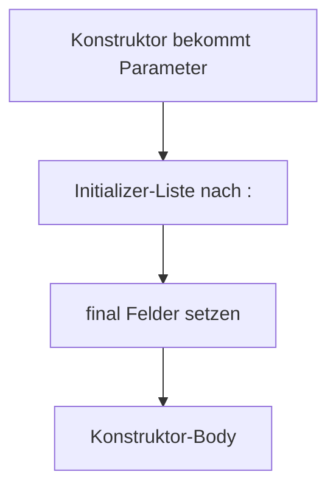

# Visual Summary - 11 Dart Syntax Tricks

> Ziel: Crazy Syntax soll nicht mehr crazy wirken.

---

## 1. Arrow Function `=>`

```text
Normale Funktion:
Input -> Body -> return Output

Arrow Function:
Input -> Ausdruck -> Output
```

```dart
int addOne(int x) => x + 1;
```

---

## 2. Null Safety `?`, `??`, `!`

```text
String name   = muss String sein
String? name  = String oder null
```

```text
name ?? 'Gast'

wenn name da ist: name
wenn name null ist: Gast
```

```text
name!

Ich verspreche: nicht null.
Wenn falsch: Crash möglich.
```

---

## 3. Spread `...`

```text
Liste A: [Text, Container]
Liste B: [Row, Column]

[...A, ...B]

Ergebnis:
[Text, Container, Row, Column]
```

---

## 4. if in Listen

```dart
children: [
  Text('Immer sichtbar'),
  if (isLoggedIn) Text('Nur wenn eingeloggt'),
]
```

```text
Bedingung true  -> Widget kommt in Liste
Bedingung false -> Widget wird übersprungen
```

---

## 5. Initializer List `:`



---

## 6. Cascade `..`

```text
Player()
  ..name = 'Real'
  ..level = 99
  ..sayHi()
```

Bedeutet:

```text
Mach mehrere Dinge mit demselben Objekt.
```

---

## 7. Was du behalten musst

| Syntax | Merksatz |
|---|---|
| `=>` | kurzer Return |
| `?` | kann null sein |
| `??` | Fallback |
| `!` | nicht-null-Versprechen |
| `...` | Liste auspacken |
| `if` in Liste | bedingtes Widget |
| `:` | Felder vor Body setzen |
| `..` | mehrere Aktionen auf Objekt |
