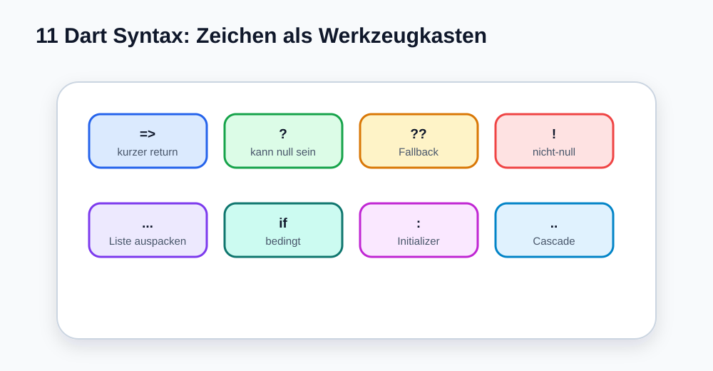

# Visual Summary - 11 Dart Syntax Tricks

> Ab hier nutzen wir echte SVG-Grafiken für visuelle Konzepte. Die Grafik soll zuerst das Bild im Kopf bauen, danach kommt Code.

## So liest du die Grafik

- Jedes Zeichen ist ein Werkzeug.
- `=>` ist kurzer Return.
- `??` ist ein Fallback.
- `...` packt Listen aus.
- `:` und `..` wirken in speziellen Dart-Mustern.
