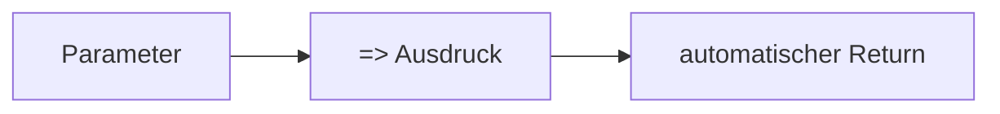
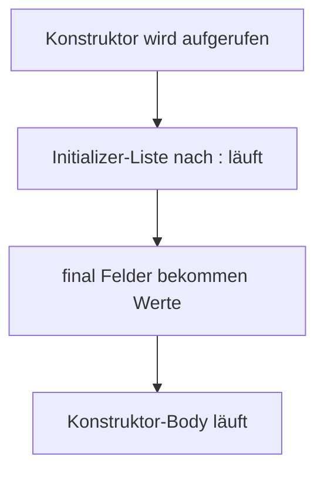

# Visual Summary - 11 Dart Syntax Tricks

## Arrow Function

```text
Normal:
int doubleNormal(int x) {
  return x * 2;
}

Kurz:
int doubleShort(int x) => x * 2;
```



## Null Safety

```text
String? name;      // kann null sein
name ?? 'Gast'     // Fallback, falls null
name!              // ich verspreche: nicht null
```

## Spread Operator

```text
final all = [
  ...basics,
  ...layout,
];

// ... packt die Liste aus
```

## Constructor mit Doppelpunkt

```text
User(String rawName)
  : name = rawName.trim(),
    slug = rawName.toLowerCase();
```



## Merksatz

Diese Zeichen sind keine Magie. Sie sind Kurzformen für Muster, die du schon kennst.
