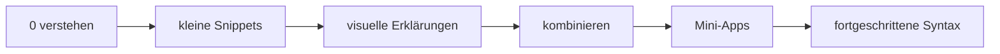
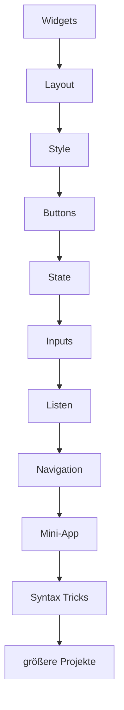

# Flutter lernen

> Eine Flutter-Lernreise von **0** bis zu sauberem App-Code — mit vielen kleinen Snippets, visuellen Markdown-Erklärungen und später zusammenhängenden Projekten.


---

## 🎯 Ziel des Repos

Dieses Repo soll nicht nur Code zeigen, sondern erklären, **warum** der Code funktioniert.

Wir lernen Flutter so:



---

## 🧠 Lernregel

Was in einer früheren Lektion erklärt wurde, wird später vorausgesetzt.

Beispiel:

- In Lektion `01` wird `MaterialApp` erklärt.
- In Lektion `02` wird es benutzt, aber nicht nochmal von 0 erklärt.
- Wenn ein neuer Zusammenhang entsteht, wird er trotzdem kurz erklärt.

So wächst das Wissen Schritt für Schritt.

---

## 📁 Aufbau

| Lektion | Thema | Ziel |
|---:|---|---|
| `00-start-hier` | App starten | verstehen, wo Flutter-Code beginnt |
| `01-widgets-und-materialapp` | Widgets | Widget-Baum und App-Grundgerüst |
| `02-container` | Container | Größe, Farbe, Margin, Padding, Decoration |
| `03-row-column` | Layout | horizontal und vertikal anordnen |
| `04-text-style-icons` | Darstellung | Text schöner machen, Icons nutzen |
| `05-buttons-und-clicks` | Interaktion | Klicks auslösen |
| `06-stateful-widget-setstate` | State | Werte ändern und UI neu bauen |
| `07-inputs-textfield` | Eingaben | User-Text lesen |
| `08-listview` | Listen | viele Elemente anzeigen |
| `09-navigation` | Seitenwechsel | Screens öffnen und zurückgehen |
| `10-zusammenhaengende-mini-app` | Mini-App | Wissen kombinieren |
| `11-dart-syntax-tricks` | Syntax Tricks | `=>`, `??`, `...`, `:` verstehen |

---

## 📌 Jede Lektion enthält

```text
LEKTION/
├── README.md      -> Erklärung, Essenz, Aufgaben
├── VISUAL.md      -> Diagramme, Skizzen, mentale Modelle
└── snippets/      -> kopierbarer Code
```

Bei späteren Projekten:

```text
LEKTION/
└── app/lib/main.dart -> zusammenhängender Flutter-Code
```

---

## 🚀 So testest du Snippets

Erstelle einmal lokal eine Flutter-Test-App:

```bash
flutter create sandbox_app
cd sandbox_app
flutter run
```

Dann:

1. Öffne `lib/main.dart`.
2. Kopiere ein Snippet aus einer Lektion hinein.
3. Speichere.
4. Nutze Hot Reload.
5. Ändere Werte und beobachte, was passiert.

---

## 🧪 Wie du richtig übst

Nicht nur lesen. Immer ändern.

| Aktion | Warum? |
|---|---|
| Farben ändern | du verstehst Properties |
| Zahlen ändern | du siehst Größen und Abstände |
| Widgets verschachteln | du verstehst den Widget-Baum |
| Fehler absichtlich machen | du lernst Fehlermeldungen lesen |
| Snippets kombinieren | du kommst Richtung echte App |

---

## 🗺️ Großer Lernpfad



---

## 🔥 Spätere Themen

- eigene Widgets sauber bauen
- Themes
- Bilder und Assets
- Forms und Validierung
- async / await
- APIs abrufen
- State Management
- Firebase / Supabase
- größere App-Struktur
- clean code in Flutter
