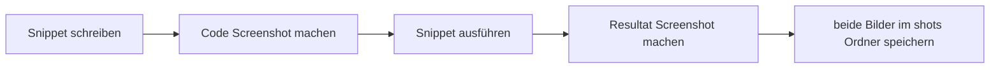

# Screenshot-Standard

> Jede Lektion soll in Zukunft nicht nur Code enthalten, sondern auch Bilder vom Code und vom Ergebnis.

---

## Ziel

Zu jedem Snippet gehören immer **zwei Bilder**:

1. **Code-Screenshot**
2. **Resultat-Screenshot**

So sieht man sofort:

- wie der Code aussieht
- was der Code visuell bewirkt

---

## Standard-Struktur

```text
LEKTION/
├── README.md
├── VISUAL.md
├── shots/
│   ├── README.md
│   ├── 01_code.png
│   ├── 01_result.png
│   ├── 02_code.png
│   └── 02_result.png
└── snippets/
```

---

## Dateinamen

| Datei | Bedeutung |
|---|---|
| `01_code.png` | Screenshot vom ersten Beispiel im Editor |
| `01_result.png` | Screenshot vom Ergebnis des ersten Beispiels |
| `02_code.png` | Screenshot vom zweiten Beispiel im Editor |
| `02_result.png` | Screenshot vom Ergebnis des zweiten Beispiels |

Für reine Dart-Dateien ohne UI darf `*_result.png` auch ein Terminal-/Output-Screenshot sein.

---

## Qualitäts-Regeln

- Code muss lesbar sein
- Screenshot sauber zuschneiden
- möglichst dunkles oder helles Theme konsistent halten
- beim Resultat nur das Wichtige zeigen
- Code- und Resultat-Screenshot müssen zueinander passen

---

## Workflow


