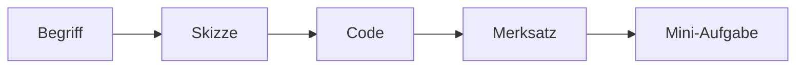

# Visuelle Markdown-Regeln für dieses Repo

Diese Datei beschreibt, wie die Lernnotizen aufgebaut werden sollen.

---

## Ziel

Markdown soll hier nicht nur Text sein. Jede Lektion soll ein Bild im Kopf erzeugen.

Gute Erklärungen bestehen aus:



---

## Standard-Aufbau pro Lektion

Jede `README.md` soll möglichst diese Bereiche haben:

| Bereich | Zweck |
|---|---|
| `Essenz` | Was ist der Kern der Lektion? |
| `Warum wichtig?` | Wofür braucht man das in echten Apps? |
| `Mentales Modell` | einfache Vorstellung im Kopf |
| `Code-Landkarte` | welche Snippets gibt es? |
| `Typische Fehler` | Dinge, die Anfänger oft falsch machen |
| `Mini-Aufgaben` | kleine Änderungen zum Üben |

---

## Standard-Aufbau pro VISUAL.md

Eine `VISUAL.md` soll enthalten:

- ASCII-Skizzen für Layouts
- Mermaid-Diagramme für Abläufe
- Tabellen für Vergleiche
- kurze Merksätze
- Pfeile für Datenfluss oder Abstände

---

## Beispiel: Margin und Padding

```text
Außenwelt / andere Widgets

<---------------------- margin ---------------------->

+----------------------------------------------------+
| Container                                           |
|                                                    |
|   <---------------- padding ------------------->   |
|                                                    |
|          +-------------------------------+         |
|          | child, z. B. Text             |         |
|          +-------------------------------+         |
|                                                    |
+----------------------------------------------------+
```

---

## Merksatz

Wenn man ein Konzept nicht zeichnen kann, hat man es meistens noch nicht richtig verstanden.
